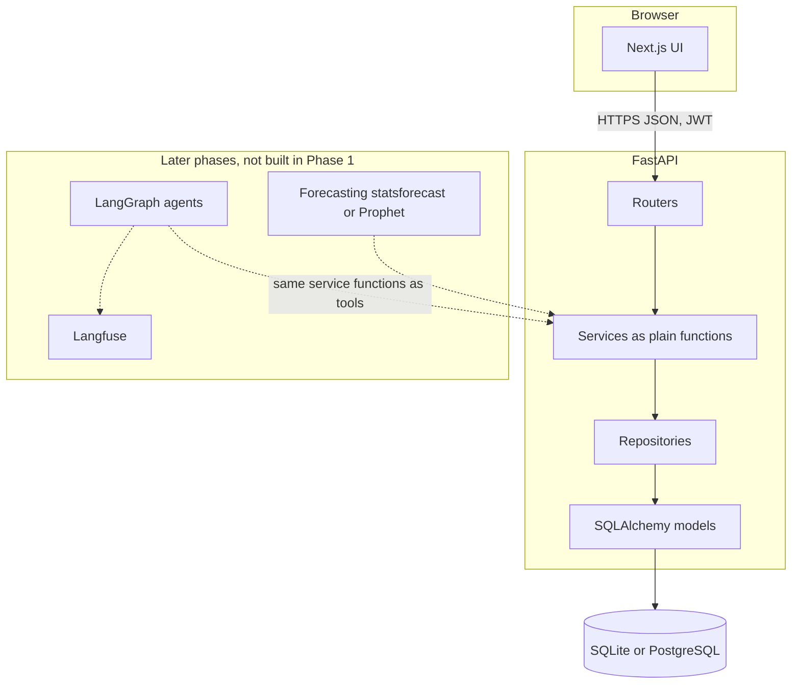
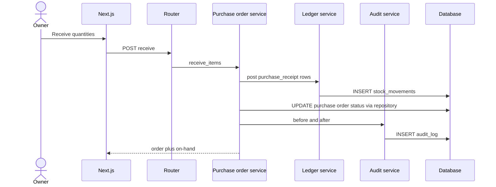

# Architecture

Phase 1 is a Next.js client and a FastAPI server. The browser never touches the database. Forecasting, LangGraph, and Langfuse are later phases and are not dependencies in Phase 1.

See [PLAN.md](PLAN.md), [WORKFLOW.md](WORKFLOW.md), and [DATA_MODEL.md](DATA_MODEL.md).

## System

## Components

| Piece | Role |
| --- | --- |
| Next.js UI | App Router, TypeScript, Tailwind, shadcn/ui. Renders workflow screens and calls the API. |
| Routers | HTTP, auth dependency, status codes. Map requests to services. No business rules. |
| Pydantic schemas | Request and response models. Decimal fields serialize as JSON strings. |
| Services | All business rules, as plain functions. Phase 3 registers these as agent tools without rewriting them. |
| Ledger service | The only writer of `stock_movements`. Insert only. |
| Audit service | The only writer of `audit_log`. Called in the same transaction as the change it records. |
| Repositories | Queries and inserts scoped by `business_id`. No business rules. |
| Models | One SQLAlchemy mapping shared by SQLite and PostgreSQL. |
| Alembic | Migrations for both databases. No database-specific types. |

Phase 1 modules: auth, onboarding, catalog, inventory, purchase orders, suppliers, dashboard reads, team, settings, audit read.

## Data flow

**Read on-hand.** The UI requests on-hand for a product and location. The stock service returns `SUM(quantity)` from `stock_movements`. Products have no on-hand column.

**Post a movement.** The UI submits a receipt, sale, adjustment, or transfer. The router calls a service. The ledger service inserts one row, or two rows for a transfer, then the audit service inserts `audit_log`, in one transaction. The response includes the new on-hand sum.

**Receive a purchase order.**

The purchase-order service does not update a stored on-hand balance. Received quantity on a line is the sum of its `purchase_receipt` movements.

## Stack

| Layer | Choice |
| --- | --- |
| Frontend | Next.js (App Router), TypeScript, Tailwind, shadcn/ui |
| Backend | FastAPI, SQLAlchemy 2, Alembic, Pydantic v2 |
| Database | SQLite for local dev. PostgreSQL (Supabase or Neon free tier) for deploy |
| Auth | JWT access token plus refresh token. Passwords hashed with argon2id |
| Tests | pytest for backend services |
| Later, not Phase 1 | LangGraph agents, forecasting with statsforecast or Prophet, Langfuse |

Auth details:

- Access token lasts 15 minutes. Claims: `sub` (user id), `business_id`, `role`.
- Refresh token lasts 7 days. It is an opaque random value stored only as a SHA-256 hash in `refresh_tokens`. Rotating refresh revokes the old row and inserts a new one.
- Password hashes use argon2id (`argon2-cffi`). Refresh tokens are not argon2-hashed.

Local dev uses `DATABASE_URL` pointing at a SQLite file. Deploy points the same setting at PostgreSQL. Application code does not branch on the dialect.

## Key design rules

1. **Layered backend.** Routers call services. Services call repositories and models. All business logic lives in the service layer as plain functions, because in Phase 3 these become agent tools.
2. **Stock is an append-only ledger.** Table `stock_movements` is insert-only. Current stock is derived from it and never edited directly. Corrections are new rows.
3. **`audit_log` exists from day one.** Every state change records who, what, when, before, and after, so agent decisions can be traced later.
4. **Money uses Decimal, never float.** Columns are `Numeric(18, 4)`. Python values are `decimal.Decimal`. JSON encodes them as strings.
5. **One model set for SQLite and PostgreSQL.** Use `Numeric` for money and quantity, `CHAR(36)` for ids (app-generated UUID strings), `VARCHAR` plus `CHECK` for enums, and `JSON` for audit payloads. No PostgreSQL-only column types and no float columns.
6. **Tenant scope comes from the token.** Repository reads and writes for business data filter on `business_id` from the JWT. The client's body does not choose the tenant.
7. **Phase 1 has no AI.** Do not import LangGraph, an LLM client, statsforecast, Prophet, or Langfuse in Phase 1.
