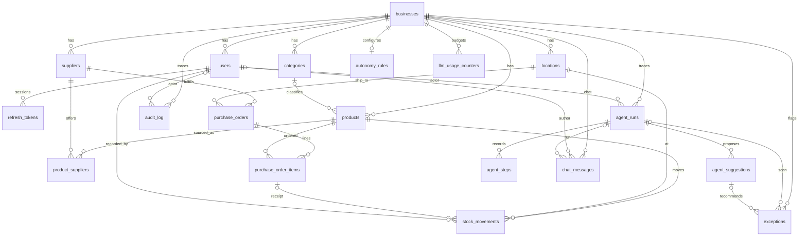

# Data model

Phase 1 schema, plus a computed Phase 2 demand forecast, the Phase 3 AI foundation tables (`agent_runs`, `agent_steps`, `agent_suggestions`, `llm_usage_counters`), orchestrator columns on `agent_runs`, `chat_messages`, and `exceptions`. No forecast table, no LangGraph checkpoint tables, and no inbox UI tables.

**Multi-tenant assumption:** a user belongs to one business. Almost every row is scoped by `business_id`. The API takes `business_id` from the JWT, not from the client. Exception: `refresh_tokens` hang off `users`. Signup creates the business and the owner together, so `users.business_id` is set immediately. The column stays nullable. `onboarding_completed_at` stays null until the onboarding wizard, which is not part of signup.

SQLite and PostgreSQL use the same models.

- Ids are UUID strings, `CHAR(36)`, generated in the app. Not a native Postgres `UUID` column.
- Enums are `VARCHAR` plus `CHECK`, not native enum types.
- Money is `NUMERIC(18, 4)`. Quantity is `NUMERIC(14, 4)`. Both are `Decimal` in Python. Never float. JSON sends them as strings.
- Timestamps are timezone-aware UTC, mapped as SQLAlchemy `DateTime(timezone=True)`, not a Postgres-only `timestamptz` column. Tables below call that type `datetime`.
- `created_at` / `updated_at` appear on mutable rows. The ledger and audit log are insert-only and have no `updated_at`.

## Relationships



Signup sets `users.business_id` and `role` (`owner`) in the same transaction as the business. Currency on that business is `USD` until onboarding changes it. `onboarding_completed_at` stays null until that wizard finishes. The diagram shows the steady state.

## Derived stock

There is no on-hand column. For one product at one location:

```sql
SELECT COALESCE(SUM(quantity), 0) AS on_hand
FROM stock_movements
WHERE business_id = :business_id
  AND product_id = :product_id
  AND location_id = :location_id;
```

Quantity is signed. Inbound is positive. Outbound is negative. `SUM` is the balance.

| Type | Sign | Rows |
| --- | --- | --- |
| `receipt` | Positive | Manual inbound stock from the Inventory page. One row at the receiving location |
| `purchase_receipt` | Positive | One row at the receiving location, linked to a purchase-order line |
| `sale` | Negative | One row per SKU. A multi-SKU checkout shares `sale_group_id` |
| `adjustment` | Positive or negative | One row. `reason` required |
| `transfer` | Negative at source, positive at destination | Two rows, one `location_id` each, same `transfer_group_id`, same absolute quantity |

Received quantity on a purchase-order line is `SUM(quantity)` of `purchase_receipt` rows with that `purchase_order_item_id`. It is not stored on the line.

Inventory value is that on-hand sum times the preferred `product_suppliers.unit_cost`. It is computed, not stored.

Demand forecasts are computed the same way. For one SKU, history is the daily sum of `sale` quantities with the sign flipped, across every location. The forecast service projects the next 14 days from that series. Nothing is written back to the ledger or to a purchase order.

`actor_type` on `audit_log` is the forward-looking hook. Phase 1 only writes `user`. A later phase may write `agent` and may add explanation storage. Do not add those tables now.

## users

| Column | Type | Notes |
| --- | --- | --- |
| id | CHAR(36) | PK |
| business_id | CHAR(36) NULL | FK businesses. Null only before onboarding |
| email | VARCHAR(320) | Unique, stored lowercase |
| password_hash | VARCHAR(255) | argon2id |
| full_name | VARCHAR(200) | |
| role | VARCHAR(20) NULL | `owner` or `staff`. Null only before onboarding |
| is_active | BOOLEAN | Default true. Deactivate, do not delete |
| invited_by_user_id | CHAR(36) NULL | FK users. Set when an owner creates staff |
| created_at | datetime | |
| updated_at | datetime | |

`CHECK (role IN ('owner', 'staff'))` when role is not null. One owner per business, enforced in the service.

## refresh_tokens

| Column | Type | Notes |
| --- | --- | --- |
| id | CHAR(36) | PK |
| user_id | CHAR(36) | FK users |
| token_hash | CHAR(64) | SHA-256 hex of the opaque token. Never store the raw token |
| expires_at | datetime | |
| revoked_at | datetime NULL | Set on logout and on rotation |
| created_at | datetime | |

## businesses

| Column | Type | Notes |
| --- | --- | --- |
| id | CHAR(36) | PK |
| name | VARCHAR(200) | |
| currency_code | CHAR(3) | ISO 4217, uppercase. Signup stores `USD`. Immutable after onboarding |
| onboarding_completed_at | datetime NULL | |
| created_at | datetime | |
| updated_at | datetime | |

One business per user in Phase 1. No currency table.

## autonomy_rules

| Column | Type | Notes |
| --- | --- | --- |
| id | CHAR(36) | PK |
| business_id | CHAR(36) | FK, unique — one row per business |
| auto_approve_below_amount | NUMERIC(18, 4) NULL | Stored for a later auto-approve path |
| exception_scan_enabled | BOOLEAN | Default true. Owner can turn off nightly scans |
| exception_scan_hour_utc | INTEGER | Default 2. Hour in UTC for the scheduled scan |
| exception_scan_last_run_on | DATE NULL | UTC date of the last completed scan |
| created_at | datetime | |
| updated_at | datetime | |

## locations

| Column | Type | Notes |
| --- | --- | --- |
| id | CHAR(36) | PK |
| business_id | CHAR(36) | FK |
| name | VARCHAR(200) | Unique per business |
| is_default | BOOLEAN | Service keeps exactly one default among active locations |
| address | TEXT NULL | |
| archived_at | datetime NULL | Archive, do not delete, once movements exist |
| created_at | datetime | |
| updated_at | datetime | |

The last active location cannot be archived.

## categories

| Column | Type | Notes |
| --- | --- | --- |
| id | CHAR(36) | PK |
| business_id | CHAR(36) | FK |
| name | VARCHAR(200) | Unique per business |
| created_at | datetime | |
| updated_at | datetime | |

Flat list. `products.category_id` is `ON DELETE SET NULL`.

## products

| Column | Type | Notes |
| --- | --- | --- |
| id | CHAR(36) | PK |
| business_id | CHAR(36) | FK |
| sku | VARCHAR(64) | Unique per business, including archived rows |
| name | VARCHAR(200) | |
| description | TEXT NULL | |
| category_id | CHAR(36) NULL | FK categories |
| unit | VARCHAR(32) | Default `each`. No unit conversion in Phase 1 |
| cost | NUMERIC(18, 4) NULL | Decimal product cost in the business currency. Null until set. Not a float |
| price | NUMERIC(18, 4) NULL | Decimal selling price in the business currency. Null until set. Not a float |
| reorder_point | NUMERIC(14, 4) NULL | Compared with on-hand summed across locations. Null means no alert |
| safety_stock | NUMERIC(14, 4) NULL | Extra quantity kept above the reorder point. Null means none. Not used in place of `reorder_point` |
| archived_at | datetime NULL | Soft delete. Ledger rows keep the FK |
| created_at | datetime | |
| updated_at | datetime | |

Archived products are hidden from the default catalog and cannot be added to new movements or new purchase orders.

## suppliers

| Column | Type | Notes |
| --- | --- | --- |
| id | CHAR(36) | PK |
| business_id | CHAR(36) | FK |
| name | VARCHAR(200) | |
| email | VARCHAR(320) NULL | |
| phone | VARCHAR(40) NULL | |
| notes | TEXT NULL | |
| archived_at | datetime NULL | |
| created_at | datetime | |
| updated_at | datetime | |

Archived suppliers cannot be used on new purchase orders. Existing orders stay.

## product_suppliers

| Column | Type | Notes |
| --- | --- | --- |
| id | CHAR(36) | PK |
| business_id | CHAR(36) | FK. Must match the product and the supplier |
| product_id | CHAR(36) | FK products |
| supplier_id | CHAR(36) | FK suppliers |
| supplier_sku | VARCHAR(64) NULL | |
| unit_cost | NUMERIC(18, 4) | Decimal. Business currency |
| lead_time_days | INTEGER | `>= 0` |
| is_preferred | BOOLEAN | Default false |
| created_at | datetime | |
| updated_at | datetime | |

Unique `(product_id, supplier_id)`. At most one `is_preferred` per product, enforced in the service (a partial unique index is not portable).

## stock_movements

Append-only. No update, no delete, no `updated_at`.

| Column | Type | Notes |
| --- | --- | --- |
| id | CHAR(36) | PK |
| business_id | CHAR(36) | FK |
| product_id | CHAR(36) | FK products. `ON DELETE RESTRICT` |
| location_id | CHAR(36) | FK locations. Exactly one location per row |
| movement_type | VARCHAR(32) | `receipt`, `purchase_receipt`, `sale`, `adjustment`, `transfer` |
| quantity | NUMERIC(14, 4) | Signed. Non-zero |
| reason | TEXT NULL | Required, non-blank, when type is `adjustment` |
| note | TEXT NULL | |
| transfer_group_id | CHAR(36) NULL | Set on both rows of a transfer. Null otherwise |
| sale_group_id | CHAR(36) NULL | Shared by lines of one sale. Null otherwise |
| purchase_order_item_id | CHAR(36) NULL | Required on `purchase_receipt`. Null on every other type |
| occurred_at | datetime | Business time. Not in the future |
| created_at | datetime | Insert time |
| created_by_user_id | CHAR(36) | FK users |

Checks:

- `movement_type` is one of the four values.
- `quantity <> 0`.
- `receipt` implies `quantity > 0`.
- `purchase_receipt` implies `quantity > 0`.
- `sale` implies `quantity < 0`.
- `adjustment` implies `reason` is non-blank.
- `transfer` implies `transfer_group_id` is not null. Other types imply it is null.
- `sale` implies `sale_group_id` is not null (one id even for a single line). Other types imply it is null.
- `purchase_receipt` implies `purchase_order_item_id` is not null. Other types imply it is null. Ad-hoc inbound stock is an `adjustment` with a reason, not a receipt.

Service rules the database cannot express portably:

- A transfer inserts two rows in one transaction: opposite signs, equal absolute quantity, same product, same group id, different locations.
- Every `sale` row gets a `sale_group_id`. Lines posted together share one id.
- A group of transfer rows sums to zero.
- Reject a posting that would make on-hand negative at that location.
- Reject a receipt that would make received quantity exceed `quantity_ordered`.
- Reject movements dated in the future.
- The repository exposes insert and select only.

Index `(business_id, product_id, location_id)` for the on-hand sum. Index `transfer_group_id` and `purchase_order_item_id`.

## purchase_orders

| Column | Type | Notes |
| --- | --- | --- |
| id | CHAR(36) | PK |
| business_id | CHAR(36) | FK |
| po_number | VARCHAR(32) | Unique per business. Service-assigned, for example `PO-0001` |
| supplier_id | CHAR(36) | FK suppliers |
| location_id | CHAR(36) | FK locations. Where stock will be received |
| status | VARCHAR(32) | `draft`, `approved`, `sent`, `received`, `cancelled` |
| currency_code | CHAR(3) | Snapshot of the business currency at creation |
| notes | TEXT NULL | |
| ordered_at | datetime NULL | Set when the order is sent. Null while it is still `draft` or `approved` |
| expected_on | DATE NULL | |
| created_by_user_id | CHAR(36) | FK users |
| created_at | datetime | |
| updated_at | datetime | |

Status values are `draft`, `approved`, `sent`, `received`, and `cancelled`. The purchase-order service moves an order along `draft` → `approved` → `sent` → `received`, or to `cancelled`. There is no `ordered` or `partially_received` status. Lines are editable only in `draft`.

## purchase_order_items

| Column | Type | Notes |
| --- | --- | --- |
| id | CHAR(36) | PK |
| business_id | CHAR(36) | FK |
| purchase_order_id | CHAR(36) | FK |
| product_id | CHAR(36) | FK |
| quantity_ordered | NUMERIC(14, 4) | `> 0` |
| unit_cost | NUMERIC(18, 4) | Snapshot at order time. Decimal |
| created_at | datetime | |
| updated_at | datetime | |

Line total is `quantity_ordered * unit_cost`, computed in the service, not stored. Do not add `quantity_received`.

## audit_log

Insert-only. Who, what, when, before, after.

| Column | Type | Notes |
| --- | --- | --- |
| id | CHAR(36) | PK |
| business_id | CHAR(36) | FK |
| actor_user_id | CHAR(36) NULL | Who. Always set in Phase 1 |
| actor_type | VARCHAR(20) | What kind of actor. Phase 1 writes `user` only |
| action | VARCHAR(80) | What, for example `stock.movement.post`, `purchase_order.receive`, `product.archive` |
| entity_type | VARCHAR(80) | For example `product`, `stock_movement`, `purchase_order` |
| entity_id | CHAR(36) | |
| before_data | JSON NULL | Before. Null on create |
| after_data | JSON NULL | After |
| created_at | datetime | When |

Written in the same transaction as the change. Phase 1 does not add `agent_run_id` or an explanation column.

## agent_runs

One row per agent or orchestrator execution. Status, `finished_at`, `error_message`, plan, and event log may change while the run is open.

| Column | Type | Notes |
| --- | --- | --- |
| id | CHAR(36) | PK |
| business_id | CHAR(36) | FK |
| agent_name | VARCHAR(80) | `orchestrator`, `echo`, later `replenishment` |
| status | VARCHAR(20) | `running`, `awaiting_approval`, `completed`, `failed`, `cancelled` |
| prompt_name | VARCHAR(80) NULL | Primary prompt for the run, when known |
| prompt_version | VARCHAR(32) NULL | Version from the prompt registry |
| actor_user_id | CHAR(36) NULL | Who started the run. Null for a later scheduled job |
| started_at | datetime | |
| finished_at | datetime NULL | Set when the run ends |
| error_message | TEXT NULL | Set on `failed` |
| input_text | TEXT NULL | User message for orchestrator runs |
| plan_data | JSON NULL | Validated DAG |
| state_data | JSON NULL | Resume payload after approval |
| events_data | JSON NULL | SSE events already emitted |
| cancel_requested | BOOLEAN | Set by `POST /chat/runs/{id}/cancel` |

## agent_steps

Append-only. Every LLM call and every tool call.

| Column | Type | Notes |
| --- | --- | --- |
| id | CHAR(36) | PK |
| run_id | CHAR(36) | FK agent_runs |
| business_id | CHAR(36) | FK |
| step_kind | VARCHAR(20) | `llm` or `tool` |
| tool_name | VARCHAR(80) NULL | Set on `tool` |
| prompt_name | VARCHAR(80) NULL | Set on `llm` |
| prompt_version | VARCHAR(32) NULL | Set on `llm` |
| input_data | JSON NULL | Messages or tool arguments |
| output_data | JSON NULL | Text, structured result, or tool output |
| duration_ms | INTEGER | |
| tokens_in | INTEGER NULL | LLM only |
| tokens_out | INTEGER NULL | LLM only |
| created_at | datetime | Insert time. No `updated_at` |

## agent_suggestions

The only write target for agent tools in this foundation. Tools never create purchase orders, send email, or post stock.

| Column | Type | Notes |
| --- | --- | --- |
| id | CHAR(36) | PK |
| business_id | CHAR(36) | FK |
| run_id | CHAR(36) | FK agent_runs |
| suggestion_type | VARCHAR(32) | `generic`, `draft_po`, `draft_email` |
| status | VARCHAR(20) | `pending` on create. Later inbox phases may set `approved`, `rejected`, `dismissed` |
| payload | JSON | Lines, supplier, email draft, or a free-form summary |
| created_at | datetime | |

## exceptions

Open findings from the exception monitor. Dedupe is unique among **open** rows per `(business_id, dedupe_key)`.

| Column | Type | Notes |
| --- | --- | --- |
| id | CHAR(36) | PK |
| business_id | CHAR(36) | FK |
| exception_type | VARCHAR(40) | `stockout_risk`, `overstock`, `demand_spike`, `demand_drop`, `supplier_delay`, `data_anomaly` |
| severity | VARCHAR(20) | `low`, `medium`, `high`, `critical` |
| status | VARCHAR(20) | `open`, `resolved`, `ignored` |
| entity_type | VARCHAR(80) | `product`, `purchase_order`, `supplier`, `stock_movement` |
| entity_id | CHAR(36) | |
| dedupe_key | VARCHAR(240) | Stable id so a nightly run does not recreate the same open issue |
| title | VARCHAR(240) | |
| evidence | JSON | Numbers and dates from detectors |
| recommended_action | VARCHAR(40) NULL | Playbook action |
| rationale | TEXT NULL | LLM sentence, clipped to playbook |
| suggestion_id | CHAR(36) NULL | FK agent_suggestions when approval is needed |
| run_id | CHAR(36) NULL | FK agent_runs |
| created_at | datetime | |
| updated_at | datetime | |

## llm_usage_counters

Per-business daily LLM budget. The window is the UTC calendar day.

| Column | Type | Notes |
| --- | --- | --- |
| id | CHAR(36) | PK |
| business_id | CHAR(36) | FK |
| usage_date | DATE | UTC date |
| request_count | INTEGER | Completed gateway calls that day |
| token_count | INTEGER | Sum of tokens in plus tokens out |
| created_at | datetime | |
| updated_at | datetime | |

Unique `(business_id, usage_date)`.

## chat_messages

Recent turns for orchestrator context. Scoped by `business_id` and `user_id`.

| Column | Type | Notes |
| --- | --- | --- |
| id | CHAR(36) | PK |
| business_id | CHAR(36) | FK |
| user_id | CHAR(36) | FK users |
| role | VARCHAR(20) | `user`, `assistant`, `system` |
| content | TEXT | |
| run_id | CHAR(36) NULL | FK agent_runs |
| created_at | datetime | |

The orchestrator loads the last `ORCHESTRATOR_CHAT_HISTORY` rows (default 6) as DATA. Names in that text are resolved to ids in code.

## Tenant and delete rules

- Child business tables use `business_id` with `ON DELETE RESTRICT`.
- `stock_movements` restrict deletes of products, locations, users, and purchase-order items.
- Users and suppliers used by history are deactivated or archived, not deleted.
- Categories may be deleted; products become uncategorized.

## Service invariants to test

- On-hand equals the sum of signed quantities.
- Sales and transfer-outs are negative; receipts and transfer-ins are positive.
- A transfer is exactly two rows, one location each, shared `transfer_group_id`, sum zero.
- An adjustment without a reason fails.
- No repository method updates or deletes `stock_movements`.
- Money and quantity round-trip as `Decimal`, not float.
- A query with business A's token never returns business B's rows.
