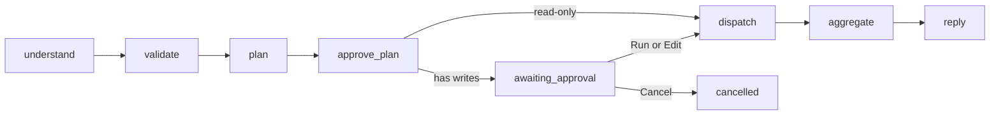
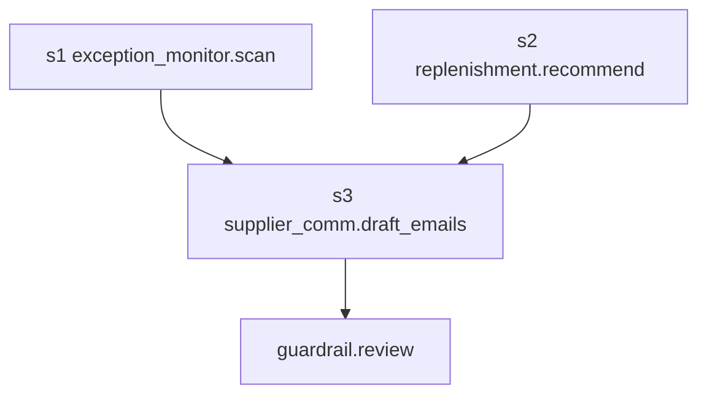

# Orchestrator

The chat orchestrator turns slash commands and free text, including compound requests, into a validated DAG of agent tasks. It is the full Phase 3A orchestrator: understand, validate, plan, optional plan approval, dispatch, aggregate, and reply.

`forecast`, `exception_monitor`, `replenishment`, `supplier_comm`, and `explainer` are filled in. `data_quality` is still a placeholder. Placeholders return typed `not implemented yet` results so the plumbing can be tested with `LLM_PROVIDER=fake`. Agent write tools never create purchase orders, send email, or post stock. They only insert `agent_suggestions` (and email drafts). A `draft_po` suggestion is inserted only after `validate_po_proposal`. Approving that suggestion creates a **draft** purchase order through the purchase-order service. Approving a supplier email sends it through `EmailSender`. Exception findings also persist to `exceptions`. The explainer is read-only: it cites stored evidence and never invents numbers.

See [ARCHITECTURE.md](ARCHITECTURE.md), [PLAN.md](PLAN.md), and [AGENTS.md](../AGENTS.md).

## Pipeline

Implemented as a LangGraph `StateGraph`. Run state is stored on `agent_runs` (`plan_data`, `state_data`, `events_data`). There are no LangGraph checkpoint tables.

| Node | What it does |
| --- | --- |
| `understand` | Slash commands map directly. Free text goes to `llm.complete_structured` as `{intents, confidence, ambiguous}`. Intents are clipped to the allowlist. Last few chat turns are DATA context. Names are resolved to ids in code. |
| `validate` | Role checks. Owner-only intents (`draft_po`, `draft_email`) are refused for staff. Low confidence or `ambiguous` becomes a clarification card. Unknown intents become a refusal that lists supported commands. |
| `plan` | One known intent uses the routing table. Compound requests let the LLM propose a DAG. Code validates it, re-plans once if invalid, otherwise asks the user. |
| `approve_plan` | Any write step (draft PO or draft email) pauses with a plan card: Run / Edit / Cancel. Read-only plans continue. |
| `dispatch` | Executes the DAG. Independent ready steps run in parallel. Outputs are `TypedResult` objects, not free text. Per-step timeout and retries. A failed step marks only its dependents `skipped`. |
| `aggregate` | Collects typed cards. The LLM writes a short summary. Every number in that summary must already appear in the results, or a template summary is used. |
| `reply` | Emits `token`, `card`, and `done` (or `cancelled` / `error`). |

## Intents and slash commands

| Slash | Intent | Agent | Task | Write | Role |
| --- | --- | --- | --- | --- | --- |
| `/stock` | `get_stock` | `forecast` | `get_stock` | no | owner, staff |
| `/forecast` | `forecast` | `forecast` | `forecast` | no | owner, staff |
| `/scan` `/exceptions` | `scan_exceptions` | `exception_monitor` | `scan` | no | owner, staff |
| `/reorder` | `reorder` | `replenishment` | `recommend` | no | owner, staff |
| `/draft-po` `/po` | `draft_po` | `replenishment` | `recommend` then `draft_po` | yes | owner |
| `/email` | `draft_email` | `replenishment` then `supplier_comm` | `recommend` then `draft_emails` | yes | owner |
| `/explain` `/why` | `explain` | `explainer` | `explain` | no | owner, staff |
| `/whatif` | `whatif` | `explainer` | `whatif` | no | owner, staff |
| `/quality` | `data_quality` | `data_quality` | `check` | no | owner, staff |

Several slash commands in one message (`/scan /reorder /email`) are treated as a compound request.

Free-text example:

> scan for problems, reorder what's needed and draft emails to the suppliers

The fake LLM maps that to `scan_exceptions`, `reorder`, and `draft_email`. Ambiguous text returns a clarification card with options. Out-of-scope text is refused with the supported command list. The model never invents a tenant id; `supplier_name` / `product_name` / `sku` are resolved against the current `business_id`.

## Routing table (single intent)

```mermaid
flowchart TB
  get_stock["get_stock -> forecast.get_stock"]
  forecast["forecast -> forecast.forecast"]
  scan["scan_exceptions -> exception_monitor.scan"]
  reorder["reorder -> replenishment.recommend"]
  explain["explain / why -> explainer.explain"]
  whatif["whatif -> explainer.whatif"]
  quality["data_quality -> data_quality.check"]
  draftPo["draft_po"]
  rec1["replenishment.recommend"]
  po["replenishment.draft_po"]
  guard1["guardrail.review"]
  draftPo --> rec1 --> po --> guard1
  draftEmail["draft_email"]
  rec2["replenishment.recommend"]
  mail["supplier_comm.draft_emails"]
  guard2["guardrail.review"]
  draftEmail --> rec2 --> mail --> guard2
```

Each write path ends in the `guardrail.review` step. Code injects that step when the LLM omits it. A plan that contains any write still pauses in `approve_plan` before dispatch.

## Compound DAG example

Request: scan, reorder, and draft supplier emails.

`s1` and `s2` are independent reads and may run in parallel. `s3` is a write and waits for both. Dispatch does not start until the owner chooses Run.

## Plan validation (code, not the model)

- Agents and tasks must be registered.
- `depends_on` ids must exist.
- No cycles.
- Step count `<= ORCHESTRATOR_MAX_STEPS` (default 12).
- A read step cannot depend on a write step.
- Every write step must be an ancestor of `guardrail.review`.
- Invalid LLM plans are rejected and re-planned once. A second failure asks the user.

## Agent registry

Agents register by name with tasks and write-tasks. Placeholders:

| Agent | Tasks | Result today |
| --- | --- | --- |
| `forecast` | `forecast`, `get_stock` | Tools: `get_history`, `run_forecast`, `get_forecast_accuracy`, `get_forecast`, `get_stock`. Typed eval (trend, chosen model, WAPE vs naive, confidence, caveats). LLM writes a one-line interpretation grounded in those fields. Read-only. |
| `exception_monitor` | `scan` | Detectors in code. LLM ranks playbook actions only. Writes `exceptions` and `agent_suggestions`. Orchestrator task is still read-only so `/scan` does not pause. |
| `replenishment` | `recommend`, `draft_po` | Tools: `reorder_recommendations`, `get_supplier_reliability`, `get_open_pos`, `create_po_suggestion`. `/reorder` is read-only. `/draft-po` and `/po` may write one suggestion per supplier after the guardrail. |
| `supplier_comm` | `draft_emails` | Tools: `get_po`, `get_supplier`, `get_exception`, `draft_email`. Templates fill PO numbers, quantities, and dates in code. The LLM writes greeting/ask/closing. A grounding check regenerates once, then falls back to the plain template. Does not send mail. |
| `explainer` | `explain`, `whatif` | Tools: `get_suggestion`, `get_run_trace`, `get_evidence`, `get_history`, `whatif_reorder`. `/why` and `/explain` cite stored evidence. Every number and date in the prose must exist on that evidence or a template is used. `/whatif` recomputes replenishment with modified demand, delay, or lead time. Unanswerable questions name the missing data. |
| `data_quality` | `check` | not implemented yet |
| `guardrail` | `review` | Re-validates purchase proposals on earlier steps. Does not create a purchase order. |

Later prompts fill the remaining placeholders in. They still must use service tools for quantities and money.

## HTTP and runs

All routes are under `/api/v1` and require a JWT. Runs are scoped to `business_id` and `actor_user_id`.

| Method | Path | Purpose |
| --- | --- | --- |
| `POST` | `/chat/runs` | Start a run from `{ "message": "..." }` |
| `GET` | `/chat/runs/{id}` | Run status, plan, and stored events for the timeline |
| `GET` | `/chat/runs/{id}/events` | SSE event stream |
| `POST` | `/chat/runs/{id}/cancel` | Cancel a running or paused run |
| `POST` | `/chat/runs/{id}/resume` | `{ "action": "run" \| "edit" \| "cancel", "plan": optional }` |

Per-user rate limit and max concurrent runs come from env (`ORCHESTRATOR_RATE_LIMIT_PER_USER_PER_MINUTE`, `ORCHESTRATOR_MAX_CONCURRENT_RUNS_PER_USER`). A paused write plan counts as concurrent until it is run or cancelled.

## SSE event protocol

Each frame is `event: <type>` plus a JSON `data` object that always includes `run_id` and `ts`.

| Event | When | Data |
| --- | --- | --- |
| `thinking` | A node starts work | `message` |
| `plan` | The DAG is accepted | `steps` |
| `step_started` | Dispatch begins a step | `step_id`, `agent`, `task` |
| `step_progress` | Optional progress | `step_id`, `message` |
| `step_done` | Step finished or skipped | `step_id`, `status`, `result_type` |
| `step_failed` | Step raised or timed out | `step_id`, `error` |
| `token` | Streamed summary text | `text` |
| `card` | Typed UI card | `card` with `type` one of `stock_table`, `forecast_chart`, `exception_list`, `po_suggestion`, `email_draft`, `explanation`, `whatif_compare`, `text`, `clarification`, `refusal`, `plan` |
| `awaiting_approval` | Write plan is waiting | `plan`, `actions`: `run`, `edit`, `cancel` |
| `done` | Terminal success, clarify, or refuse | `status`, `summary` |
| `error` | Run crashed | `message`, `code` |
| `cancelled` | User cancelled | empty payload |

Reconnect by calling `GET .../events` again. The server replays stored `events_data` then tails live rows.

## Cards

Aggregate emits one card per finished step (skipped dependents are omitted):

- `stock_table`
- `forecast_chart`
- `exception_list`
- `po_suggestion`
- `email_draft`
- `explanation`
- `whatif_compare`
- `text`
- `clarification` (options, never a guess)
- `refusal` (supported commands)

The summary LLM sees those typed objects inside `<<DATA>>` blocks. If it invents a number that is not in the JSON, code replaces the summary with `Finished N steps: X succeeded, Y failed, Z skipped.`

## Assumptions

- LangGraph is used only for this orchestrator graph. No LangChain agents and no Langfuse.
- Tests always use `LLM_PROVIDER=fake`. Live providers cannot be constructed under pytest.
- `supplier_comm` drafts emails from order facts and never sends them. `explainer` cites stored evidence and never invents numbers. `data_quality` is still a placeholder. `forecast`, `exception_monitor`, and `replenishment` call service tools. The DAG, approval, SSE, cancel, and summary checks are in.
- Write tools still only insert `agent_suggestions` (and `supplier_messages` drafts). `create_po_suggestion` and `create_draft_po_suggestion` refuse a `draft_po` row unless `validate_po_proposal` passed. `draft_email` inserts a `supplier_messages` draft. The exception monitor also inserts `exceptions` rows through a service, never purchase orders or ledger rows.
- Chat has an API and an Agent Inbox chat UI. The forecast agent, exception monitor, replenishment agent, supplier communication agent, and explainer are filled in.
- Nightly scans: `POST /api/v1/jobs/exception-scan` (owner JWT or `X-Job-Secret`). Optional in-process scheduler when `EXCEPTION_SCAN_SCHEDULER_ENABLED=true`. Owners set `exception_scan_enabled`, `exception_scan_hour_utc`, and `chase_followup_days` on autonomy rules. Default hour is 02:00 UTC. Default chase follow-up is 3 days. The scheduler is off in pytest.
- Supplier email: `EMAIL_SENDER=console` (default) logs and never delivers; `smtp` uses `EMAIL_FROM` / `EMAIL_SMTP_*`. Inbox shows a banner in console mode. `POST /api/v1/supplier-replies` stores a paste or webhook. Reply text is DATA. Extracted delay/date become owner-approved suggestions (`update_po_expected_date`).
- Plan approval is plan-level, not per step. Independent reads still run after one Run click.
- Tenant ids come from the JWT. The model cannot choose `business_id`.
- SQLite and PostgreSQL share `agent_runs` extras, `chat_messages`, and `exceptions`. LangGraph does not own extra tables. Approving a suggestion does not add a table.

### Forecast agent (numbers from code)

Tools: `get_forecast`, `run_forecast`, `get_history`, `get_forecast_accuracy`. Insights `get_forecast` is unchanged (seasonal naive / daily average / no sales). `run_forecast` backtests the last 7 days and picks the lower WAPE of `daily_average` vs `seasonal_naive`, compared with a last-value naive baseline.

Typed per-SKU fields: forecast summary, trend (`up`/`down`/`flat` at ±10% last 7 vs prior 7), chosen model, backtest WAPE, naive WAPE, confidence, caveats (`low_history` if span < 14 days, `intermittent_demand` if ≥60% zero days with some sales). The LLM may write one grounded sentence. Invented numbers are replaced with a template.

### Exception monitor (detection from code)

Pure detectors in `app/services/detectors.py`:

| Detector | Fires when | Severity notes |
| --- | --- | --- |
| `stockout_risk` | days of cover (`on_hand / daily_demand`) < lead time (preferred supplier, else 7) | high if cover < 0.5×lead; critical if on-hand is 0 with demand |
| `overstock` | days of cover > 90 | high if > 180. No demand → no overstock |
| `demand_spike` | last 7 / prior 7 > 1.5 or robust z > 2.5 | |
| `demand_drop` | ratio < 0.5 or z < -2.5 | Quiet SKUs (0 vs 0) do not fire |
| `supplier_delay` | PO `approved`/`sent` with `expected_on` before today; or reliability_score < 0.7 and overdue_count ≥ 2 | |
| `data_anomaly` | negative on-hand; duplicate sales (same product/location/minute/qty); \|adjustment\| > max(100, 3×14-day forecast) | |
| `chase_no_reply` | a sent chase with no `supplier_replies` row after `autonomy_rules.chase_followup_days` (default 3) | always low; playbook is `ignore` |

Dedupe key is stable (`{type}:{entity_id}` or a more specific anomaly key). An open row is updated, not re-inserted.

Playbooks in `app/agents/playbooks.py` list ordered actions (`reorder_now`, `expedite`, `alternate_supplier`, `transfer_stock`, `count_stock`, `ignore`) with preconditions in code. The LLM may only pick from that list; anything else is clipped to the first valid action. Approval-needed actions become `agent_suggestions`.

### Replenishment agent (quantities from code)

`/reorder` runs `replenishment.recommend` (owner and staff, no write). `/draft-po <supplier>` and `/po <supplier>` run `recommend`, then `draft_po` (owner only), then `guardrail.review`. The remainder of the slash command is the supplier name.

Tools: `reorder_recommendations` (on-hand, reorder point, safety stock, forecast, recommended quantity, and linked suppliers), `get_supplier_reliability`, `get_open_pos`, `create_po_suggestion`.

The model may only choose which real recommendation rows to keep, whether to prefer a linked alternate when the preferred supplier is late, and a confidence from 0 to 1. Unknown product ids are dropped. If every id is unknown, code uses the real rows. Quantities and unit costs are copied from the recommendation and the `product_suppliers` row. The model cannot add a reason code the evidence does not support.

Reason codes: `LOW_COVER` on every included row, `FORECAST_UP` when forecast units are above the reorder point, `SUPPLIER_LATE` when the preferred or chosen supplier has reliability under 0.7 or at least one overdue PO, `ALTERNATE_SUPPLIER` when the chosen link is not preferred.

Confidence at or above `ORCHESTRATOR_CONFIDENCE_MIN` (default 0.7) is required to write. Missing supplier cost, a non-integer recommended quantity, or low confidence produces a message and no suggestion. A non-integer quantity is not rounded. An open draft, approved, or sent PO whose quantity already covers the recommended quantity is skipped. One suggestion is stored per supplier.

`POST /api/v1/suggestions/{id}/approve` (owner) runs the guardrail again and creates a **draft** purchase order. `POST /api/v1/suggestions/{id}/reject` stores `{ "reason": "..." }`. Decisions live on the suggestion payload (`decisions`: action, reason, actor, time, and `purchase_order_id` when approved) and on `audit_log`. The purchase order still needs the normal approve and send flow.

### Purchase guardrail (no LLM)

`validate_po_proposal` in `app/services/guardrail.py` checks that the supplier and SKUs belong to the business, the supplier is active, quantities are positive whole numbers, each line is within `PO_MAX_LINE_QUANTITY` (default 1000), the proposal has at most `PO_MAX_LINES` (default 40), unit cost matches `product_suppliers.unit_cost` within `PO_COST_TOLERANCE_RATIO` (default 0.01), and the total is within `PO_MAX_TOTAL` (default 50000). It rejects the proposal when an open draft, approved, or sent PO already covers that SKU quantity. It does not fall back to the product catalog cost.

`required_approval` is `auto` only when `autonomy_rules.auto_approve_below_amount` is set and the total is strictly below that amount. Null means the owner has not enabled auto-approve, so the result is `human`. Auto-approve still inserts the suggestion, marks it `auto_approved`, and creates a draft purchase order. A failed check always reports `human` and stores nothing.

`create_suggestion(..., suggestion_type="draft_po")` raises `guardrail_required` unless the guarded creator opened the gate after a passing check. The Orders screen and demo seed still call `create_po` for a person, not for an agent.

### Supplier communication agent (facts from code)

`/email <supplier> <order|chase|expedite|delay-notice>` is owner-only. Compound plans may include `supplier_comm.draft_emails`. Default kind is `chase` when the supplier has an approved or sent PO, otherwise `order`. Missing supplier asks `/email <supplier> chase`.

Tools: `get_po`, `get_supplier`, `get_exception`, `draft_email`. Quantities, dates, and PO numbers come from those tools. The LLM returns greeting, ask, and closing only. Code fills a template, checks that every PO number, quantity, and date is in the facts, regenerates wording once, then falls back to the plain template. `draft_email` inserts `supplier_messages` (`status=draft`) and a `draft_email` suggestion. It never calls `EmailSender`.

The Inbox card shows editable subject and body, Approve and Send, Save draft, and Reject. `POST /api/v1/supplier-messages/{id}/send` is owner-only. Failed SMTP sets `status=failed` and keeps the body. Console mode (`EMAIL_SENDER=console`) logs the message and shows a banner.

`POST /api/v1/supplier-replies` (JWT or `X-Job-Secret`) stores the raw body as DATA. Injection markers empty the extracted fields. Confirmed dates or delay days become a generic suggestion (`extra.action=update_po_expected_date`) that the owner must approve. A sent chase with no reply after `chase_followup_days` raises `chase_no_reply`.

### Explainer agent (evidence from code)

`/why <suggestion|exception|PO>` and `/explain` are read-only. Free text such as "why did you suggest 200 units?" maps to `explain`. `/whatif <scenario>` is also read-only.

Tools: `get_suggestion`, `get_run_trace`, `get_evidence`, `get_history`, `whatif_reorder`. Suggestion and exception payloads store reason codes, on-hand, forecast units and model, lead time, and reliability at the decision site. `agent_steps` is the run trace.

The LLM writes prose from that typed evidence only. After generation, every number and date in the answer must already appear in the evidence. Otherwise code replaces the answer with a template built from the same fields. The card includes confidence and what would change the decision. If the evidence cannot answer, the agent says so and lists the missing data.

`/whatif` supports supplier delay of N days, demand up/down X percent, and lead-time change. Code calls `whatif_compare` (the replenishment formula with modified inputs). The LLM only narrates the before/after stockout date, recommended quantity, and cost.

Inbox suggestion and exception cards have a Why? button that sends `/why …` into chat. The explanation card has a collapsible evidence table. What-if results use a before/after comparison card. Insights has an Ask why box that opens Inbox with the question.

