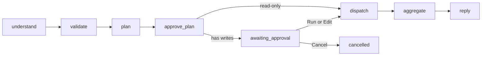
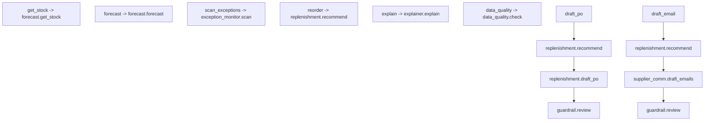
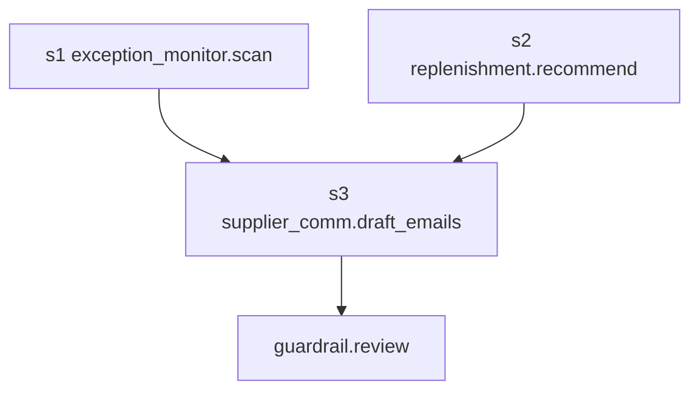

# Orchestrator

The chat orchestrator turns slash commands and free text, including compound requests, into a validated DAG of agent tasks. It is the full Phase 3A orchestrator: understand, validate, plan, optional plan approval, dispatch, aggregate, and reply.

`forecast` and `exception_monitor` are filled in. Other concrete agents are still placeholders. They return typed `not implemented yet` results so the plumbing can be tested with `LLM_PROVIDER=fake`. Write steps never create purchase orders, send email, or post stock. They only insert `agent_suggestions`. Exception findings also persist to `exceptions`.

See [ARCHITECTURE.md](ARCHITECTURE.md), [PLAN.md](PLAN.md), and [AGENTS.md](../AGENTS.md).

## Pipeline

Implemented as a LangGraph `StateGraph`. Run state is stored on `agent_runs` (`plan_data`, `state_data`, `events_data`). There are no LangGraph checkpoint tables.

| Node | What it does |
| --- | --- |
| `understand` | Slash commands map directly. Free text goes to `llm.complete_structured` as `{intents, confidence, ambiguous}`. Intents are clipped to the allowlist. Last few chat turns are DATA context. Names are resolved to ids in code. |
| `validate` | Role checks. Owner-only intents (`draft_po`, `draft_email`) are refused for staff. Low confidence or `ambiguous` becomes a clarification card. Unknown intents become a refusal that lists supported commands. |
| `plan` | One known intent uses the routing table. Compound requests let the LLM propose a DAG. Code validates it, re-plans once if invalid, otherwise asks the user. |
| `approve_plan` | Any write step (draft PO or draft email) pauses with a plan card: Run / Edit / Cancel. Read-only plans continue. |
| `dispatch` | Executes the DAG. Independent ready steps run in parallel. Outputs are `TypedResult` objects, not free text. Per-step timeout and retries. A failed step marks only its dependents `skipped`. |
| `aggregate` | Collects typed cards. The LLM writes a short summary. Every number in that summary must already appear in the results, or a template summary is used. |
| `reply` | Emits `token`, `card`, and `done` (or `cancelled` / `error`). |

## Intents and slash commands

| Slash | Intent | Agent | Task | Write | Role |
| --- | --- | --- | --- | --- | --- |
| `/stock` | `get_stock` | `forecast` | `get_stock` | no | owner, staff |
| `/forecast` | `forecast` | `forecast` | `forecast` | no | owner, staff |
| `/scan` `/exceptions` | `scan_exceptions` | `exception_monitor` | `scan` | no | owner, staff |
| `/reorder` | `reorder` | `replenishment` | `recommend` | no | owner, staff |
| `/draft-po` `/po` | `draft_po` | `replenishment` | `recommend` then `draft_po` | yes | owner |
| `/email` | `draft_email` | `replenishment` | `recommend` then `supplier_comm.draft_emails` | yes | owner |
| `/explain` | `explain` | `explainer` | `explain` | no | owner, staff |
| `/quality` | `data_quality` | `data_quality` | `check` | no | owner, staff |

Several slash commands in one message (`/scan /reorder /email`) are treated as a compound request.

Free-text example:

> scan for problems, reorder what's needed and draft emails to the suppliers

The fake LLM maps that to `scan_exceptions`, `reorder`, and `draft_email`. Ambiguous text returns a clarification card with options. Out-of-scope text is refused with the supported command list. The model never invents a tenant id; `supplier_name` / `product_name` / `sku` are resolved against the current `business_id`.

## Routing table (single intent)

Each write path ends in the `guardrail.review` step. Code injects that step when the LLM omits it. A plan that contains any write still pauses in `approve_plan` before dispatch.

## Compound DAG example

Request: scan, reorder, and draft supplier emails.

`s1` and `s2` are independent reads and may run in parallel. `s3` is a write and waits for both. Dispatch does not start until the owner chooses Run.

## Plan validation (code, not the model)

- Agents and tasks must be registered.
- `depends_on` ids must exist.
- No cycles.
- Step count `<= ORCHESTRATOR_MAX_STEPS` (default 12).
- A read step cannot depend on a write step.
- Every write step must be an ancestor of `guardrail.review`.
- Invalid LLM plans are rejected and re-planned once. A second failure asks the user.

## Agent registry

Agents register by name with tasks and write-tasks. Placeholders:

| Agent | Tasks | Result today |
| --- | --- | --- |
| `forecast` | `forecast`, `get_stock` | Tools: `get_history`, `run_forecast`, `get_forecast_accuracy`, `get_forecast`, `get_stock`. Typed eval (trend, chosen model, WAPE vs naive, confidence, caveats). LLM writes a one-line interpretation grounded in those fields. Read-only. |
| `exception_monitor` | `scan` | Detectors in code. LLM ranks playbook actions only. Writes `exceptions` and `agent_suggestions`. Orchestrator task is still read-only so `/scan` does not pause. |
| `replenishment` | `recommend`, `draft_po` | not implemented yet |
| `supplier_comm` | `draft_emails` | not implemented yet |
| `explainer` | `explain` | not implemented yet |
| `data_quality` | `check` | not implemented yet |
| `guardrail` | `review` | records that the plan was gated |

Later prompts fill the placeholders in. They still must use service tools for quantities and money.

## HTTP and runs

All routes are under `/api/v1` and require a JWT. Runs are scoped to `business_id` and `actor_user_id`.

| Method | Path | Purpose |
| --- | --- | --- |
| `POST` | `/chat/runs` | Start a run from `{ "message": "..." }` |
| `GET` | `/chat/runs/{id}` | Run status, plan, and stored events for the timeline |
| `GET` | `/chat/runs/{id}/events` | SSE event stream |
| `POST` | `/chat/runs/{id}/cancel` | Cancel a running or paused run |
| `POST` | `/chat/runs/{id}/resume` | `{ "action": "run" \| "edit" \| "cancel", "plan": optional }` |

Per-user rate limit and max concurrent runs come from env (`ORCHESTRATOR_RATE_LIMIT_PER_USER_PER_MINUTE`, `ORCHESTRATOR_MAX_CONCURRENT_RUNS_PER_USER`). A paused write plan counts as concurrent until it is run or cancelled.

## SSE event protocol

Each frame is `event: <type>` plus a JSON `data` object that always includes `run_id` and `ts`.

| Event | When | Data |
| --- | --- | --- |
| `thinking` | A node starts work | `message` |
| `plan` | The DAG is accepted | `steps` |
| `step_started` | Dispatch begins a step | `step_id`, `agent`, `task` |
| `step_progress` | Optional progress | `step_id`, `message` |
| `step_done` | Step finished or skipped | `step_id`, `status`, `result_type` |
| `step_failed` | Step raised or timed out | `step_id`, `error` |
| `token` | Streamed summary text | `text` |
| `card` | Typed UI card | `card` with `type` one of `stock_table`, `forecast_chart`, `exception_list`, `po_suggestion`, `email_draft`, `text`, `clarification`, `refusal`, `plan` |
| `awaiting_approval` | Write plan is waiting | `plan`, `actions`: `run`, `edit`, `cancel` |
| `done` | Terminal success, clarify, or refuse | `status`, `summary` |
| `error` | Run crashed | `message`, `code` |
| `cancelled` | User cancelled | empty payload |

Reconnect by calling `GET .../events` again. The server replays stored `events_data` then tails live rows.

## Cards

Aggregate emits one card per finished step (skipped dependents are omitted):

- `stock_table`
- `forecast_chart`
- `exception_list`
- `po_suggestion`
- `email_draft`
- `text`
- `clarification` (options, never a guess)
- `refusal` (supported commands)

The summary LLM sees those typed objects inside `<<DATA>>` blocks. If it invents a number that is not in the JSON, code replaces the summary with `Finished N steps: X succeeded, Y failed, Z skipped.`

## Assumptions

- LangGraph is used only for this orchestrator graph. No LangChain agents and no Langfuse.
- Tests always use `LLM_PROVIDER=fake`. Live providers cannot be constructed under pytest.
- Placeholder agents except `forecast` and `exception_monitor` do not call inventory tools yet. The DAG, approval, SSE, cancel, and summary checks are in. `forecast` reads demand through service tools. `exception_monitor` runs detectors in code.
- Write tools, when filled in later, still only insert `agent_suggestions`. The exception monitor also inserts `exceptions` rows through a service, never purchase orders or ledger rows.
- Chat has an API and an Agent Inbox chat UI. The forecast agent and exception monitor are filled in. Other concrete agents are still placeholders.
- Nightly scans: `POST /api/v1/jobs/exception-scan` (owner JWT or `X-Job-Secret`). Optional in-process scheduler when `EXCEPTION_SCAN_SCHEDULER_ENABLED=true`. Owners set `exception_scan_enabled` and `exception_scan_hour_utc` on autonomy rules. Default hour is 02:00 UTC. The scheduler is off in pytest.

### Forecast agent (numbers from code)

Tools: `get_forecast`, `run_forecast`, `get_history`, `get_forecast_accuracy`. Insights `get_forecast` is unchanged (seasonal naive / daily average / no sales). `run_forecast` backtests the last 7 days and picks the lower WAPE of `daily_average` vs `seasonal_naive`, compared with a last-value naive baseline.

Typed per-SKU fields: forecast summary, trend (`up`/`down`/`flat` at ±10% last 7 vs prior 7), chosen model, backtest WAPE, naive WAPE, confidence, caveats (`low_history` if span < 14 days, `intermittent_demand` if ≥60% zero days with some sales). The LLM may write one grounded sentence. Invented numbers are replaced with a template.

### Exception monitor (detection from code)

Pure detectors in `app/services/detectors.py`:

| Detector | Fires when | Severity notes |
| --- | --- | --- |
| `stockout_risk` | days of cover (`on_hand / daily_demand`) < lead time (preferred supplier, else 7) | high if cover < 0.5×lead; critical if on-hand is 0 with demand |
| `overstock` | days of cover > 90 | high if > 180. No demand → no overstock |
| `demand_spike` | last 7 / prior 7 > 1.5 or robust z > 2.5 | |
| `demand_drop` | ratio < 0.5 or z < -2.5 | Quiet SKUs (0 vs 0) do not fire |
| `supplier_delay` | PO `approved`/`sent` with `expected_on` before today; or reliability_score < 0.7 and overdue_count ≥ 2 | |
| `data_anomaly` | negative on-hand; duplicate sales (same product/location/minute/qty); \|adjustment\| > max(100, 3×14-day forecast) | |

Dedupe key is stable (`{type}:{entity_id}` or a more specific anomaly key). An open row is updated, not re-inserted.

Playbooks in `app/agents/playbooks.py` list ordered actions (`reorder_now`, `expedite`, `alternate_supplier`, `transfer_stock`, `count_stock`, `ignore`) with preconditions in code. The LLM may only pick from that list; anything else is clipped to the first valid action. Approval-needed actions become `agent_suggestions`.
- Plan approval is plan-level, not per step. Independent reads still run after one Run click.
- Tenant ids come from the JWT. The model cannot choose `business_id`.
- SQLite and PostgreSQL share `agent_runs` extras, `chat_messages`, and `exceptions`. LangGraph does not own extra tables.
